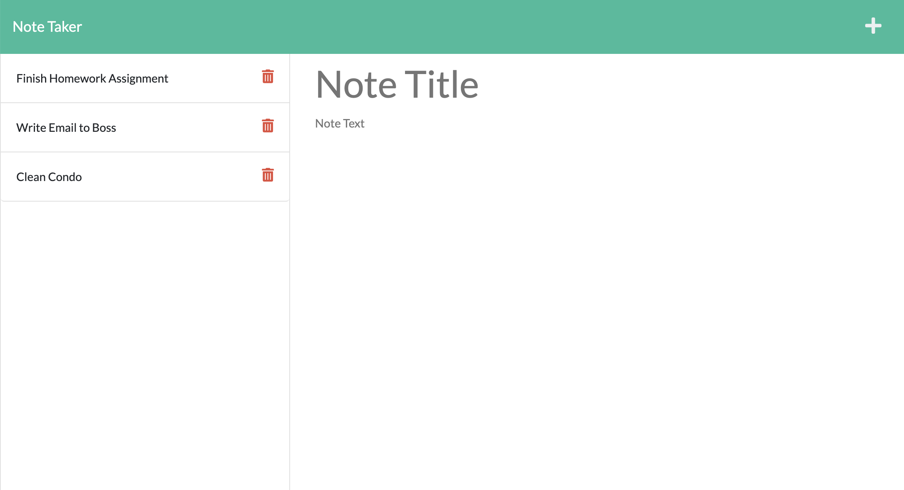

# Note Taker

## Table of contents
* [Description](#description)
* [Installation](#installation)
* [Usage](#usage)
* [Technologies](#technologies)
* [Process](#process)
* [Results](#results)
* [Credit](#credit)

## Description
Create an application for a small business owner to write, save and delete notes.

## Installation
To install this application, type “npm install" in the command line.

## Usage
To run this application, type "npm start" in the command line. and navigate to http://localhost:3001/.

## Technologies
Project was updated using:
* VS Code
* JavaScript
* Node.js
* Express.js
* Insomnia
* Heroku
* Terminal
* Git
* GitHub

## Process
### STEP 1. - SETUP
* Cloned the starter code and created my own repository on GitHub
* Rearranged files
* Pushed first commit of files into the new Repo using Git
* Deployed to Heroku

### STEP 2. - SET UP ROUTES
* Set up server.js file, connected to the server, and connected express.js
* Created a routes folder that contains index files for apiRoutes and htmlRoutes
* Routed server.js to the correct locations in the routes folders

### STEP 3. - CREATE FUNCTIONALITY
* Created GET, POST, and DELETE requests and tested with Insomnia

### STEP 4. - FINALIZE
* Made various commits throughout process to save progress
* Saved and committed work to Heroku and GitHub
* Made tweaks and finished README.md

## Results
* [Heroku Link]()
* [GitHub Repository](https://github.com/etrenholm/note-taker)

## Credit
Erica Trenholm: https://github.com/etrenholm

### ©️ April 2022